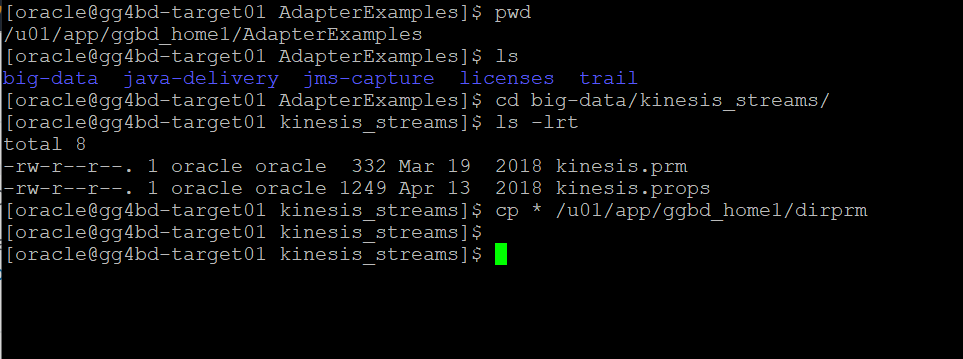
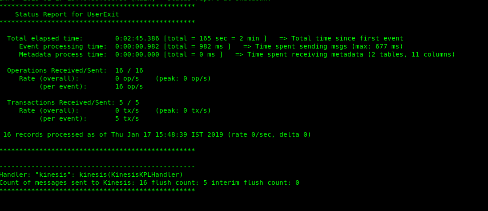

# Oracle to AWS Kinesis Replication.
Now we will be working on the Target machine.We have a trail file created in the GGBD home in the /dirdat/oraTrails directory with the name tr. We will be using this trail file to send to a Kafka topic.

1. Copy the kinesis.props & kinesis.prm file to dirprm folder in your Golden Gate installation folder in your target machine from ./dirprm Directory.
```
[oracle@gg4bd-target01 ggbd_home1]$ cd dirprm
[oracle@gg4bd-target01 dirprm]$ vi kinesis.props
```
Copy paste the below text in kinesis.props.


## KINESIS properties for Kafka Topic apply

```
gg.handlerlist=kinesis
gg.handler.kinesis.type=kinesis_streams
gg.handler.kinesis.mode=op
gg.handler.kinesis.format=json
gg.handler.kinesis.region=<your-aws-region>
#The following resolves the Kinesis stream name as the short table name
gg.handler.kinesis.streamMappingTemplate=<Kinesis-stream-name>
#The following resolves the Kinesis partition key as the concatenated primary keys
gg.handler.kinesis.partitionMappingTemplate=QASOURCE
#QASOURCE is the schema name used in the sample trail file
gg.handler.kinesis.deferFlushAtTxCommit=true
gg.handler.kinesis.deferFlushOpCount=1000
gg.handler.kinesis.formatPerOp=true
#gg.handler.kinesis.proxyServer=www-proxy-hqdc.us.oracle.com
#gg.handler.kinesis.proxyPort=80
goldengate.userexit.writers=javawriter
javawriter.stats.display=TRUE
javawriter.stats.full=TRUE
gg.log=log4j
gg.log.level=DEBUG
gg.report.time=30sec
gg.classpath=<path-to-your-aws-java-sdk>/aws-java-sdk-1.11.429/lib/*:<path-to-your-aws-java-sdk>/aws-java-sdk-1.11.429/third-party/lib/*e
##Configured with access id and secret key configured elsewhere
javawriter.bootoptions=-Xmx512m -Xms32m -Djava.class.path=ggjava/ggjava.jar
##Configured with access id and secret key configured here
javawriter.bootoptions=-Xmx512m -Xms32m -Djava.class.path=ggjava/ggjava.jar -Daws.accessKeyId=<access-key-of-new-created-user> -Daws.secretKey=<secret-ke-new-created-user>

```
Save the text using wq!

2. Add the replicat with the below commands.
REPLICAT kinesis
-- Trail file for this example is located in "AdapterExamples/trail" directory
-- Command to add REPLICAT
-- add replicat kinesis, exttrail AdapterExamples/trail/tr
TARGETDB LIBFILE libggjava.so SET property=dirprm/kinesis.props
REPORTCOUNT EVERY 1 MINUTES, RATE
GROUPTRANSOPS 1
MAP QASOURCE.*, TARGET QASOURCE.*;

3. Add the replicat with the below command.
add replicat kinesis, exttrail ./dirdat/oraTrails/tr

4. Crosscheck for kinesis replicat’s status, RBA and stats.
Once you get the stats, you can view the kinesis.log from. /dirrpt directory which gives information about data sent to kinesis data stream and operations performed.


