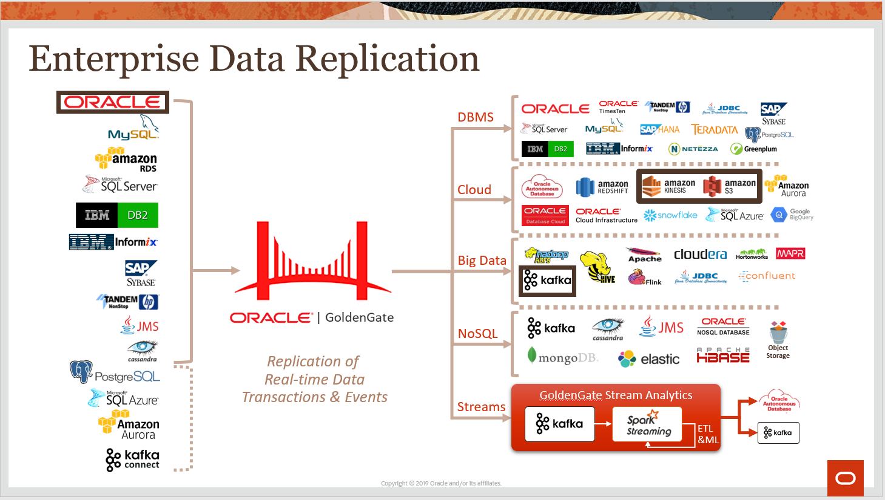

# Goldengate for Big Data

## How to Prepare for This Workshop 

- Once you are viewing the workshop's gitHub page's website, you can see a list of Lab Guides at any time by clicking on the **Menu Icon**

## Oracle Golgengate for Big Data Workshop

Welcome to the Golden Gate for Big Data Workshop. The content will give you a basic understanding of Golden Gate and Big Data Cloud Service and many of the capabilities related to provisioning, data preparation and internals.  The labs are as follows:

-  Lab 1 - Oracle to Kafka (json / avro format)
-  Lab 2 - Replication To AWS S3
-  Lab 3 - Replication To AWS Kinesis

## Workshop architecture

- Source: Oracle Database
- Target: Kafka, AWS S3 & AWS Kinesis

## Workshop Details

**Reference the following Lab Guides by opening their Documentation Files:**

## Lab 1 - Oracle to Kafka

**Documentation**: [CloudWorkshop\_GoldenGate-For-Bigdata\Lab 1. Replication To Kafka.md](CloudWorkshop\_GoldenGate-For-Bigdata\Lab 1. Replication To Kafka.md)

### Objectives
-   Extract from Oracle to generate the Trail Files on Source
-   Dump the trail files from Source to target machine
-   Replicate from trail files on the target machine to Kafka topic.
## Lab 2 - Replication To AWS S3
## Lab 3 - Replication TO AWS Kinesis
